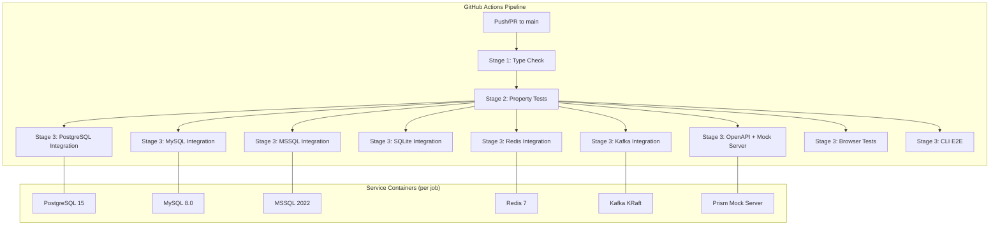
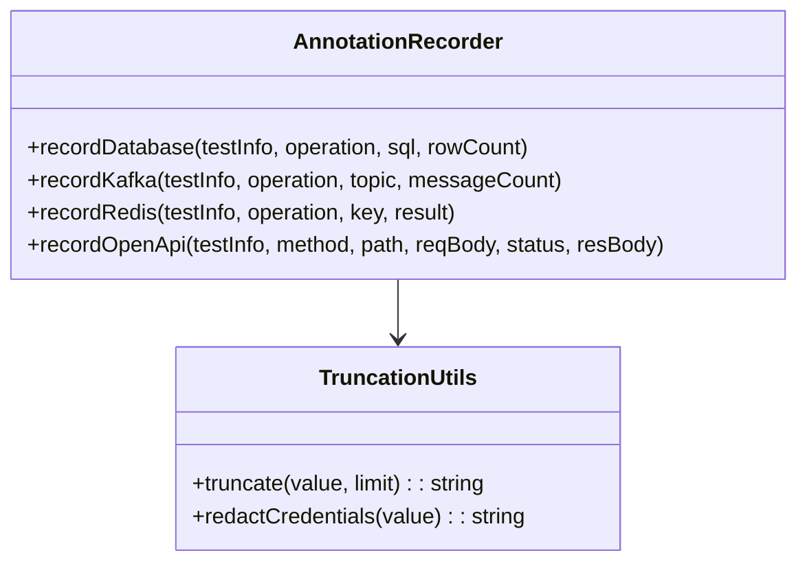

# Design Document: CI/CD Emulated Testing

## Overview

This feature enables the Playwright framework template's integration tests to run automatically in GitHub Actions by providing containerized infrastructure services (PostgreSQL, MySQL, MSSQL, SQLite, Redis, Kafka), an OpenAPI mock server, browser testing, and a staged pipeline execution order. The design covers:

1. A GitHub Actions workflow file (`.github/workflows/integration-tests.yml`) with service containers and staged job execution
2. Conditional test skip logic based on the `CI` environment variable
3. A test annotation system for observability (recording fixture operations as Playwright annotations)
4. A browser test file targeting the Petstore Swagger UI
5. An environment variable validation step to fail fast on misconfiguration

The pipeline follows a staged execution model: type checking → property tests → integration/browser tests (parallel), ensuring fast feedback on failures.

## Architecture



### Staged Execution Model

| Stage | Jobs | Dependencies |
|-------|------|--------------|
| 1 | `typecheck` | None |
| 2 | `property-tests` | `typecheck` |
| 3 | `test-postgres`, `test-mysql`, `test-mssql`, `test-sqlite`, `test-redis`, `test-kafka`, `test-openapi`, `test-browser`, `test-cli-e2e` | `property-tests` |

If any upstream stage fails, all downstream stages are skipped.

## Components and Interfaces

### 1. GitHub Actions Workflow File

**Location:** `.github/workflows/integration-tests.yml`

The workflow defines:
- **Triggers:** `push` to `main`, `pull_request` targeting `main`
- **Jobs:** Staged execution with `needs` dependencies
- **Service containers:** PostgreSQL, MySQL, MSSQL, Redis, Kafka (per-job)
- **Environment variables:** `PW_*` prefixed vars matching service container configs
- **Artifacts:** HTML reports and trace files with 7-day retention

### 2. Conditional Skip Guard

**Pattern:** Replace static `test.skip()` with `CI`-conditional skip.

```typescript
// Before (current):
test.skip();

// After:
test.skip(!process.env.CI, 'Skipped: requires CI infrastructure');
```

**Affected files:**
- `tests/examples/database.spec.ts`
- `tests/examples/kafka.spec.ts`
- `tests/examples/redis.spec.ts`
- `tests/examples/openapi.spec.ts`
- `tests/examples/browser.spec.ts` (new file)

The `test.skip(condition, reason)` API is Playwright's built-in conditional skip. When `process.env.CI` is any non-empty string, the condition `!process.env.CI` evaluates to `false`, so tests run. When `CI` is unset/empty, the condition is `true` and tests are skipped.

### 3. Test Annotation System

**Location:** `src/annotations/` (new module)

A lightweight annotation layer that wraps fixture operations and attaches metadata to the current Playwright test using `testInfo.annotations`.



### 4. Browser Test File

**Location:** `tests/examples/browser.spec.ts`

A new test file that navigates to the Petstore Swagger UI, verifies page load, expands an endpoint group, triggers a request, and asserts a response is displayed.

### 5. Environment Variable Validation Script

**Location:** `.github/scripts/validate-env.sh` or inline step

A shell script that checks all required `PW_*` environment variables are set before test execution begins. Fails the job with a clear error message indicating which variable is missing.

### 6. OpenAPI Mock Server

**Tool:** [Prism](https://github.com/stoplightio/prism) — a lightweight OpenAPI mock server that generates schema-valid responses from an OpenAPI spec.

**Usage in CI:**
```bash
npx @stoplight/prism-cli mock https://petstore.swagger.io/v2/swagger.json --port 4010 &
```

Prism is started as a background process, polled for readiness, then tests run against `http://localhost:4010`.

## Data Models

### Annotation Metadata Types

```typescript
/** Base annotation structure attached to Playwright testInfo.annotations */
interface FixtureAnnotation {
    type: 'fixture-operation';
    description: string;
}

/** Database operation annotation metadata */
interface DatabaseAnnotation {
    fixture: 'database';
    operation: 'query' | 'execute';
    sql: string;          // truncated to 2048 chars
    rowCount: number;
}

/** Kafka operation annotation metadata */
interface KafkaAnnotation {
    fixture: 'kafka';
    operation: 'produce' | 'consume';
    topic: string;
    messageCount: number;
}

/** Redis operation annotation metadata */
interface RedisAnnotation {
    fixture: 'redis';
    operation: 'get' | 'set' | 'del' | 'publish' | 'subscribe';
    key: string;
    result: string;       // truncated to 1024 chars
}

/** OpenAPI operation annotation metadata */
interface OpenApiAnnotation {
    fixture: 'openapi';
    method: string;
    path: string;
    requestBody: string;  // truncated to 4096 chars
    responseStatus: number;
    responseBody: string; // truncated to 4096 chars
}
```

### Truncation Limits

| Context | Limit | Indicator |
|---------|-------|-----------|
| SQL statement | 2048 chars | `[truncated]` |
| Redis result | 1024 chars | `[truncated]` |
| HTTP request body | 4096 chars | `[truncated]` |
| HTTP response body | 4096 chars | `[truncated]` |

### Credential Redaction Patterns

The annotation system scans values for common credential patterns and replaces matches with `[REDACTED]`:
- `password=...` / `pwd=...` in connection strings
- `Bearer ...` / `Basic ...` authorization headers
- `token=...` / `api_key=...` query parameters
- Values matching common secret patterns (AWS keys, JWT tokens)

## Correctness Properties

*A property is a characteristic or behavior that should hold true across all valid executions of a system — essentially, a formal statement about what the system should do. Properties serve as the bridge between human-readable specifications and machine-verifiable correctness guarantees.*

### Property 1: CI skip guard evaluates correctly for any non-empty string

*For any* non-empty string value assigned to `process.env.CI`, the skip condition `!process.env.CI` SHALL evaluate to `false`, causing infrastructure-dependent tests to execute rather than skip.

**Validates: Requirements 9.1, 14.2, 15.4, 16.4**

### Property 2: Annotation value truncation preserves prefix and appends indicator

*For any* string value and any positive truncation limit, if the string length exceeds the limit, the truncated output SHALL have length equal to `limit + "[truncated]".length`, SHALL start with the first `limit` characters of the original string, and SHALL end with the `[truncated]` indicator. If the string length does not exceed the limit, the output SHALL equal the original string unchanged.

**Validates: Requirements 12.7**

### Property 3: Credential redaction replaces all sensitive patterns

*For any* annotation value string containing credential patterns (password fields, bearer tokens, API keys, connection string secrets), the redaction function SHALL replace all matched credential values with `[REDACTED]` while preserving the non-sensitive portions of the string unchanged.

**Validates: Requirements 12.6**

### Property 4: Database annotation contains required metadata

*For any* SQL string and non-negative row count, the database annotation formatter SHALL produce an annotation containing the operation type (`query` or `execute`), the SQL statement (truncated to 2048 characters if necessary), and the exact row count.

**Validates: Requirements 12.2**

### Property 5: Kafka annotation contains required metadata

*For any* topic name string and non-negative message count, the Kafka annotation formatter SHALL produce an annotation containing the operation type (`produce` or `consume`), the exact topic name, and the exact message count.

**Validates: Requirements 12.3**

### Property 6: Redis annotation contains required metadata

*For any* key or channel name string and any result value string, the Redis annotation formatter SHALL produce an annotation containing the operation type, the exact key/channel name, and the result value (truncated to 1024 characters if necessary).

**Validates: Requirements 12.4**

### Property 7: OpenAPI annotation contains required metadata

*For any* HTTP method, request path, request body string, response status code, and response body string, the OpenAPI annotation formatter SHALL produce an annotation containing all five fields with request and response bodies truncated to 4096 characters if necessary.

**Validates: Requirements 12.5**

### Property 8: Required environment variable validation rejects incomplete configurations

*For any* subset of the required environment variables (`PW_DB_TYPE`, `PW_DB_HOST`, `PW_DB_PORT`, `PW_DB_NAME`, `PW_DB_USERNAME`, `PW_DB_PASSWORD`, `PW_KAFKA_BROKERS`, `PW_REDIS_HOST`, `PW_REDIS_PORT`, `PW_REDIS_KEY_PREFIX`) where at least one variable is missing or empty, the validation function SHALL return a failure result identifying the missing variable name.

**Validates: Requirements 8.7**

## Error Handling

### Pipeline-Level Errors

| Error Condition | Behavior |
|----------------|----------|
| Service container health check timeout | Job fails before test execution with container name in error |
| `npm ci` failure | Job fails immediately, no tests run |
| Type check failure | All downstream jobs skipped |
| Property test failure | All integration/browser jobs skipped |
| Mock server startup failure | OpenAPI job fails with "mock server did not start" message |
| Missing required env var | Job fails with "Missing required variable: PW_VAR_NAME" message |
| Browser install failure | Browser job fails with browser name in error |

### Test-Level Errors

| Error Condition | Behavior |
|----------------|----------|
| CI=true but service unreachable | Test fails with `FixtureInitError` (not silently skipped) |
| CI unset/empty | Tests skipped with reason message |
| Annotation recording failure | Annotation failure is logged but does not fail the test |
| Truncation of annotation value | Value truncated with `[truncated]` indicator appended |

### Design Decisions

1. **Prism over custom mock server:** Prism generates schema-valid responses automatically from the OpenAPI spec, requiring zero custom code. It's well-maintained and widely used.
2. **KRaft mode for Kafka:** Eliminates the need for a separate ZooKeeper container, reducing complexity and startup time.
3. **`test.skip(condition)` over custom skip logic:** Uses Playwright's built-in conditional skip API, which integrates with reporters and shows skip reasons in output.
4. **Annotations via `testInfo.annotations`:** Uses Playwright's native annotation system, which appears in HTML reports and trace files without custom reporter code.
5. **Separate annotation module:** Keeps annotation logic decoupled from fixture implementations, making it testable in isolation.
6. **Staged pipeline with `needs`:** Provides fast feedback (type errors in ~30s, property failures in ~2min) before expensive integration tests run.

## Testing Strategy

### Property-Based Tests (fast-check)

Property-based testing applies to the annotation system and validation logic — pure functions with clear input/output behavior and large input spaces.

**Library:** `fast-check ^3.22.0` (already in project dependencies)

**Configuration:**
- Minimum 100 iterations per property test
- Each test tagged with: `Feature: cicd-emulated-testing, Property {N}: {description}`
- Tests located in `tests/properties/` with `*.prop.ts` naming

**Properties to implement:**
1. CI skip guard evaluation (Property 1)
2. Annotation truncation (Property 2)
3. Credential redaction (Property 3)
4. Database annotation formatting (Property 4)
5. Kafka annotation formatting (Property 5)
6. Redis annotation formatting (Property 6)
7. OpenAPI annotation formatting (Property 7)
8. Env var validation (Property 8)

### Unit Tests (example-based)

- Browser test file structure validation (correct imports, test count)
- Specific credential patterns (Bearer token, connection string password)
- Edge cases: empty strings, exactly-at-limit strings, undefined CI value

### Integration Tests

- Full pipeline execution validated via GitHub Actions (manual trigger or PR)
- Mock server startup and response validation
- Service container connectivity from test code

### Smoke Tests (YAML validation)

- Workflow file is valid YAML
- All required service containers are defined
- Job dependencies form correct DAG
- Artifact upload steps present with correct retention
- Environment variables match service container configs

### Test Execution in CI

The pipeline itself validates the feature by running all test types:
- `npm run typecheck` — catches type errors in annotation types
- `npx playwright test --project=property-tests` — validates annotation logic properties
- `npx playwright test --project=api-integration` — validates fixtures connect to service containers
- `npx playwright test --project=openapi` — validates mock server integration
- `npx playwright test --project=browser-*` — validates browser testing against Swagger UI
- `npx playwright test tests/integration/cli-e2e.spec.ts` — validates CLI scaffolding
