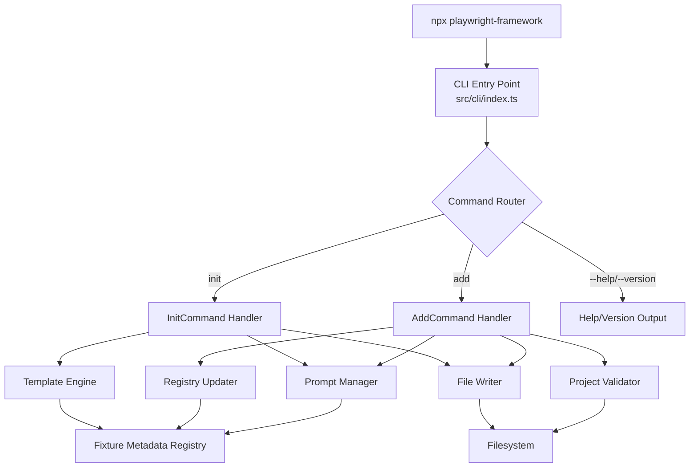

# Design Document: CLI Init and Add Commands

## Overview

This design adds a CLI layer to the Playwright Framework Template, exposing two commands — `init` and `add` — that automate project scaffolding and fixture integration. The CLI is implemented as a Node.js binary entry point using a lightweight command parser, a template engine for file generation, and a fixture metadata registry that drives all output decisions.

The architecture separates concerns into:
- **CLI entry point** — argument parsing, command routing, help/version output
- **Command handlers** — orchestrate the init and add workflows
- **Template engine** — generates files from fixture metadata and user selections
- **Fixture metadata registry** — single source of truth for dependencies, config shapes, and file templates

This design ensures that adding a new fixture in the future requires only updating the metadata registry — no changes to command handlers or template logic.

## Architecture



### High-Level Flow

**Init Command:**
1. Validate target directory is empty (no existing `package.json`)
2. Prompt for fixture selection (or use `--fixtures` flag)
3. Prompt for secrets provider (or use `--secrets-provider` flag)
4. Generate all project files using template engine + fixture metadata
5. Print summary with next steps

**Add Command:**
1. Validate project structure exists
2. Resolve fixture name (argument or prompt)
3. Validate fixture name against supported set
4. Generate fixture file and example test (skip if exists)
5. Update fixture registry (skip if already registered)
6. Update package.json dependencies (skip duplicates)
7. Update environments.json config entry
8. Print summary with install reminder

## Components and Interfaces

### CLI Entry Point (`src/cli/index.ts`)

The binary entry point registered in `package.json` under the `bin` field. Parses top-level arguments and routes to command handlers.

```typescript
#!/usr/bin/env node

interface CliOptions {
  command: 'init' | 'add' | undefined;
  help: boolean;
  version: boolean;
  args: string[];
  flags: Record<string, string | boolean>;
}

function parseArgs(argv: string[]): CliOptions;
function run(options: CliOptions): Promise<void>;
```

**Design Decision:** No external CLI framework (e.g., Commander, yargs) is used. The command set is small (2 commands, ~5 flags total), so a hand-rolled parser keeps dependencies minimal and avoids version conflicts with consumer projects. The interactive prompts use `@inquirer/prompts` which is lightweight and supports multi-select, single-select, and confirm patterns.

### Fixture Metadata Registry (`src/cli/fixtures-metadata.ts`)

A static data structure defining everything the CLI needs to know about each fixture. This is the single source of truth that drives all generation logic.

```typescript
interface FixtureMetadata {
  /** Fixture identifier (lowercase) */
  name: string;
  /** npm packages required by this fixture */
  dependencies: Record<string, string>;
  /** Fixture entries exported (some fixtures export multiple, e.g., mobilewright) */
  registryEntries: string[];
  /** Import path relative to fixtures directory */
  importPath: string;
  /** Exported fixture object name */
  exportedObject: string;
  /** Config keys for environments.json */
  configTemplate: Record<string, unknown>;
  /** Environment variables for .env.local.example */
  envVars: string[];
  /** Additional registry fixtures needed (e.g., redisConfig for redis) */
  internalDependencies?: InternalDependency[];
}

interface InternalDependency {
  /** Name of the internal fixture (e.g., 'redisConfig') */
  name: string;
  /** Code snippet for the fixture definition */
  definition: string;
}

const FIXTURE_METADATA: Record<string, FixtureMetadata> = {
  openapi: {
    name: 'openapi',
    dependencies: { 'openapi-client-axios': '^7.5.5' },
    registryEntries: ['openApiClient'],
    importPath: './openapi.fixture',
    exportedObject: 'openApiFixture',
    configTemplate: { specPath: './specs/api.yaml', baseUrl: 'http://localhost:3000' },
    envVars: ['PW_OPENAPI_SPEC_PATH', 'PW_OPENAPI_BASE_URL'],
  },
  database: {
    name: 'database',
    dependencies: { 'pg': '^8.13.0', 'mysql2': '^3.11.0', 'better-sqlite3': '^11.6.0' },
    registryEntries: ['databaseClient'],
    importPath: './database.fixture',
    exportedObject: 'databaseFixture',
    configTemplate: { type: 'postgresql', host: 'localhost', port: 5432, database: 'testdb', username: '', password: '' },
    envVars: ['PW_DB_TYPE', 'PW_DB_HOST', 'PW_DB_PORT', 'PW_DB_NAME', 'PW_DB_USERNAME', 'PW_DB_PASSWORD'],
  },
  kafka: {
    name: 'kafka',
    dependencies: { 'kafkajs': '^2.2.4' },
    registryEntries: ['kafkaClient'],
    importPath: './kafka.fixture',
    exportedObject: 'kafkaFixture',
    configTemplate: { brokers: ['localhost:9092'] },
    envVars: ['PW_KAFKA_BROKERS'],
  },
  redis: {
    name: 'redis',
    dependencies: { 'ioredis': '^5.4.1' },
    registryEntries: ['redisConfig', 'redisClient'],
    importPath: './redis.fixture',
    exportedObject: 'redisFixture',
    configTemplate: { host: 'localhost', port: 6379 },
    envVars: ['PW_REDIS_HOST', 'PW_REDIS_PORT', 'PW_REDIS_PASSWORD'],
    internalDependencies: [{
      name: 'redisConfig',
      definition: '/* redisConfig fixture loaded from ConfigLoader */',
    }],
  },
  mobilewright: {
    name: 'mobilewright',
    dependencies: { 'mobilewright': '^0.0.35', '@mobilewright/test': '^0.0.35' },
    registryEntries: ['mobilewrightDevice', 'mobilewrightScreen'],
    importPath: './mobilewright.fixture',
    exportedObject: 'mobilewrightFixture',
    configTemplate: { platform: 'ios', bundleId: '', deviceName: '', appPath: '' },
    envVars: ['PW_MOBILE_PLATFORM', 'PW_MOBILE_BUNDLE_ID', 'PW_MOBILE_DEVICE_NAME', 'PW_MOBILE_APP_PATH'],
  },
};
```

### Secrets Provider Metadata (`src/cli/secrets-metadata.ts`)

```typescript
interface SecretsProviderMetadata {
  name: string;
  envVars: string[];
  optionsTemplate: Record<string, unknown>;
}

const SECRETS_PROVIDERS: Record<string, SecretsProviderMetadata> = {
  aws: { name: 'aws', envVars: ['AWS_REGION', 'AWS_SECRET_PREFIX'], optionsTemplate: { region: '', secretPrefix: '' } },
  azure: { name: 'azure', envVars: ['AZURE_KEY_VAULT_URL'], optionsTemplate: { keyVaultUrl: '' } },
  'env-file': { name: 'env-file', envVars: [], optionsTemplate: {} },
  gitlab: { name: 'gitlab', envVars: ['GITLAB_PROJECT_ID', 'GITLAB_API_URL'], optionsTemplate: { projectId: '', apiUrl: '' } },
  vault: { name: 'vault', envVars: ['VAULT_URL', 'VAULT_MOUNT_PATH'], optionsTemplate: { url: '', mountPath: '' } },
};
```

### Prompt Manager (`src/cli/prompts.ts`)

Handles all interactive prompts with TTY detection and flag-based bypass.

```typescript
interface PromptManager {
  /** Multi-select fixtures for init command */
  selectFixtures(available: string[]): Promise<string[]>;
  /** Single-select fixture for add command */
  selectFixture(available: string[]): Promise<string>;
  /** Single-select secrets provider */
  selectSecretsProvider(available: string[], defaultValue: string): Promise<string>;
  /** Check if interactive mode is available */
  isInteractive(): boolean;
}
```

**Design Decision:** The prompt manager checks `process.stdin.isTTY` before displaying prompts. If stdin is not a TTY and the `--yes` flag is not provided, it throws an error directing the user to use `--yes` or run in a terminal.

### Template Engine (`src/cli/templates/`)

Each generated file has a corresponding template function that accepts fixture metadata and returns file content as a string.

```typescript
// Template function signatures
function generatePackageJson(fixtures: FixtureMetadata[], projectName?: string): string;
function generateTsConfig(): string;
function generatePlaywrightConfig(): string;
function generateEnvironmentsJson(fixtures: FixtureMetadata[], secretsProvider: SecretsProviderMetadata): string;
function generateEnvExample(fixtures: FixtureMetadata[], secretsProvider: SecretsProviderMetadata): string;
function generateFixtureRegistry(fixtures: FixtureMetadata[]): string;
function generateBarrelFile(fixtures: FixtureMetadata[]): string;
function generateErrorsFile(): string;
function generateConfigModules(): { envLoader: string; schema: string; loader: string; index: string };
```

**Design Decision:** Templates are pure functions (string in, string out) rather than file-based templates (e.g., Handlebars, EJS). This keeps the implementation simple, avoids template engine dependencies, and makes the output fully testable as pure functions.

### Init Command Handler (`src/cli/commands/init.ts`)

```typescript
interface InitOptions {
  fixtures?: string[];       // from --fixtures flag
  secretsProvider?: string;  // from --secrets-provider flag
  yes?: boolean;             // from --yes flag
  targetDir: string;         // current working directory
}

class InitCommand {
  constructor(
    private readonly metadata: typeof FIXTURE_METADATA,
    private readonly secretsMetadata: typeof SECRETS_PROVIDERS,
    private readonly promptManager: PromptManager,
    private readonly fileWriter: FileWriter,
  ) {}

  async execute(options: InitOptions): Promise<void>;
  
  private validateTargetDir(dir: string): void;
  private resolveFixtures(options: InitOptions): Promise<string[]>;
  private resolveSecretsProvider(options: InitOptions): Promise<string>;
  private generateFiles(fixtures: FixtureMetadata[], secrets: SecretsProviderMetadata, dir: string): string[];
  private printSummary(generatedFiles: string[]): void;
  private rollback(generatedFiles: string[]): void;
}
```

### Add Command Handler (`src/cli/commands/add.ts`)

```typescript
interface AddOptions {
  fixtureName?: string;  // positional argument
  yes?: boolean;         // from --yes flag
  targetDir: string;     // current working directory
}

class AddCommand {
  constructor(
    private readonly metadata: typeof FIXTURE_METADATA,
    private readonly promptManager: PromptManager,
    private readonly fileWriter: FileWriter,
    private readonly registryUpdater: RegistryUpdater,
  ) {}

  async execute(options: AddOptions): Promise<void>;
  
  private validateProjectStructure(dir: string): void;
  private resolveFixtureName(options: AddOptions): Promise<string>;
  private validateFixtureName(name: string): string;
  private generateFixtureFile(fixture: FixtureMetadata, dir: string): string | null;
  private generateExampleTest(fixture: FixtureMetadata, dir: string): string | null;
  private updateRegistry(fixture: FixtureMetadata, dir: string): boolean;
  private updatePackageJson(fixture: FixtureMetadata, dir: string): void;
  private updateEnvironmentsJson(fixture: FixtureMetadata, dir: string): void;
  private printSummary(created: string[], modified: string[], skipped: string[]): void;
}
```

### Registry Updater (`src/cli/registry-updater.ts`)

Handles parsing and modifying the existing `src/fixtures/index.ts` file to add new fixture imports and compositions.

```typescript
class RegistryUpdater {
  /** Check if a fixture is already registered */
  isRegistered(registryContent: string, fixture: FixtureMetadata): boolean;
  
  /** Add a fixture import and spread to the registry */
  addFixture(registryContent: string, fixture: FixtureMetadata): string;
  
  /** Add an internal dependency (e.g., redisConfig) */
  addInternalDependency(registryContent: string, dep: InternalDependency): string;
}
```

**Design Decision:** The registry updater uses string manipulation with marker comments rather than AST parsing. The fixture registry file follows a predictable structure (imports at top, `allFixtures` object with spreads), so regex-based insertion at known positions is reliable and avoids heavy AST dependencies. The generated registry file includes marker comments (`// CLI:IMPORTS` and `// CLI:FIXTURES`) to make insertion points explicit.

### File Writer (`src/cli/file-writer.ts`)

Handles atomic file operations with rollback support.

```typescript
class FileWriter {
  private writtenFiles: string[] = [];
  
  /** Write a file, tracking it for potential rollback */
  write(filePath: string, content: string): void;
  
  /** Create a directory if it doesn't exist */
  ensureDir(dirPath: string): void;
  
  /** Check if a file exists */
  exists(filePath: string): boolean;
  
  /** Read a file's content */
  read(filePath: string): string;
  
  /** Update an existing file (read-modify-write) */
  update(filePath: string, modifier: (content: string) => string): void;
  
  /** Remove all files written in this session (rollback) */
  rollback(): void;
}
```

## Data Models

### CLI Argument Model

```typescript
interface ParsedArgs {
  command: 'init' | 'add' | null;
  positional: string[];  // e.g., fixture name for add
  flags: {
    help: boolean;
    version: boolean;
    yes: boolean;
    fixtures?: string;          // comma-separated
    secretsProvider?: string;
  };
}
```

### Scaffold Manifest

Tracks what the init command will generate, used for summary output and rollback.

```typescript
interface ScaffoldManifest {
  files: Array<{
    path: string;        // relative to project root
    category: 'config' | 'fixture' | 'test' | 'source';
  }>;
  directories: string[];  // directories created
}
```

### Fixture Validation Result

```typescript
type ValidationResult = 
  | { valid: true; normalizedName: string }
  | { valid: false; error: string; validNames: string[] };
```

### Package.json Dependency Diff

```typescript
interface DependencyDiff {
  added: Record<string, string>;    // new dependencies
  skipped: Record<string, string>;  // already present
}
```

## Correctness Properties

*A property is a characteristic or behavior that should hold true across all valid executions of a system — essentially, a formal statement about what the system should do. Properties serve as the bridge between human-readable specifications and machine-verifiable correctness guarantees.*

### Property 1: Init scaffolding produces dependencies consistent with fixture selection

*For any* non-empty subset of supported fixtures, the generated `package.json` SHALL contain exactly the union of npm dependencies defined in the fixture metadata for the selected fixtures — no more, no less (excluding framework base dependencies like `@playwright/test` and `dotenv`).

**Validates: Requirements 1.2, 3.3, 3.4**

### Property 2: Init scaffolding produces environment config consistent with fixture selection

*For any* non-empty subset of supported fixtures and any valid secrets provider, the generated `environments.json` SHALL contain a `local` environment entry with configuration keys for exactly the selected fixtures and a `secrets` object with the `provider` field matching the selected provider.

**Validates: Requirements 1.5, 5.2**

### Property 3: Init scaffolding produces env vars consistent with fixture and provider selection

*For any* non-empty subset of supported fixtures and any valid secrets provider, the generated `.env.local.example` SHALL contain exactly the union of environment variable names from the selected fixtures' metadata plus the selected secrets provider's environment variables.

**Validates: Requirements 1.6, 5.3**

### Property 4: Init scaffolding produces a fixture registry consistent with selection

*For any* non-empty subset of supported fixtures, the generated `src/fixtures/index.ts` SHALL import exactly the selected fixtures' modules and spread exactly their exported fixture objects (including internal dependencies like `redisConfig`) into the composed `allFixtures` object.

**Validates: Requirements 1.7, 1.8, 3.1, 3.2**

### Property 5: Init scaffolding produces a barrel file consistent with selection

*For any* non-empty subset of supported fixtures, the generated `src/index.ts` SHALL re-export the type and value exports corresponding to exactly the selected fixtures plus the config and error modules.

**Validates: Requirements 1.11**

### Property 6: Fixture name validation accepts valid names case-insensitively and rejects invalid names

*For any* string, the fixture name validator SHALL accept it if and only if its lowercase form matches one of the supported fixture names (database, kafka, mobilewright, openapi, redis), and SHALL reject all other strings with an error listing valid names.

**Validates: Requirements 2.1, 2.2, 4.3**

### Property 7: Add command registry update is idempotent

*For any* valid fixture and any existing registry content, applying the registry update when the fixture is already registered SHALL produce the same registry content (no duplicates, no modifications).

**Validates: Requirements 2.5, 2.10, 3.5**

### Property 8: Add command dependency update produces no duplicates

*For any* valid fixture and any existing `package.json` content (with or without some of the fixture's dependencies already present), the dependency update SHALL result in all required packages being present exactly once with correct version ranges.

**Validates: Requirements 2.6, 3.4, 3.5**

### Property 9: --fixtures flag parsing produces correct fixture set

*For any* comma-separated string of valid fixture names (with arbitrary whitespace and casing), the flag parser SHALL produce a normalized array containing exactly those fixture names in lowercase.

**Validates: Requirements 4.2**

### Property 10: Unrecognized command rejection

*For any* string that is not "init", "add", "--help", or "--version", the CLI command router SHALL reject it with a non-zero exit code and include help text in the error output.

**Validates: Requirements 6.5**

### Property 11: Secrets provider validation

*For any* string provided as `--secrets-provider` value, the validator SHALL accept it if and only if its lowercase form matches one of the supported providers (aws, azure, env-file, gitlab, vault), and SHALL reject all other strings with an error listing valid providers.

**Validates: Requirements 5.4, 5.5**

## Error Handling

### Error Categories

| Error Scenario | Exit Code | Behavior |
|---|---|---|
| Existing project detected (init) | 1 | Abort immediately, no files written |
| Zero fixtures selected | 1 | Abort immediately, no files written |
| Invalid fixture name | 1 | Print error with valid names list |
| Invalid secrets provider | 1 | Print error with valid providers list |
| Missing project structure (add) | 1 | Print error listing missing paths |
| File write failure (init) | 1 | Rollback all generated files, print failed path |
| File write failure (add) | 1 | Leave file in original state, print error |
| Non-TTY without --yes | 1 | Print error suggesting --yes flag |
| Unrecognized command | 1 | Print error + help text |

### Rollback Strategy (Init Command)

The init command tracks all files written during scaffolding. If any write fails:
1. Stop generation immediately
2. Delete all files written so far (in reverse order)
3. Remove any empty directories created
4. Print error identifying the failed file

The `FileWriter` class maintains a `writtenFiles` stack for this purpose.

### Add Command Error Recovery

The add command modifies existing files (package.json, environments.json, fixture registry). For each modification:
1. Read the original content before modification
2. Attempt the write
3. If the write fails, the file remains unchanged (read-modify-write is not partial)
4. Report which file could not be updated

### User-Facing Error Messages

All error messages follow a consistent format:
```
Error: <brief description>

<details or suggestions>
```

Examples:
- `Error: A project already exists in this directory (package.json found).`
- `Error: Invalid fixture name "mongo". Valid fixtures: database, kafka, mobilewright, openapi, redis`
- `Error: Missing project structure. Expected: src/fixtures/, package.json, environments.json`

## Testing Strategy

### Property-Based Tests

Property-based testing is well-suited for this feature because the core logic consists of pure functions (template generators, validators, metadata lookups) with meaningful input variation (fixture subsets, provider choices, string inputs).

**Library:** `fast-check` (already in project dependencies)
**Configuration:** Minimum 100 iterations per property test
**Tag format:** `Feature: cli-init-and-add, Property {number}: {property_text}`

Property tests target:
- Template generator functions (given fixture metadata → output content)
- Fixture name validator (arbitrary strings → accept/reject)
- Secrets provider validator (arbitrary strings → accept/reject)
- Registry updater idempotence (existing content + fixture → updated content)
- Dependency diff calculator (existing deps + fixture deps → merged deps)
- Flag parser (comma-separated strings → normalized arrays)
- Command router (arbitrary strings → route/reject)

### Unit Tests (Example-Based)

Unit tests cover specific scenarios and edge cases:
- Init aborts when `package.json` exists
- Init aborts with zero fixtures selected
- Add validates project structure (missing each required path)
- Add skips existing fixture files with warning
- Add skips already-registered fixtures with warning
- Static file generation (tsconfig, playwright.config, errors.ts)
- Non-TTY detection and error
- `--yes` flag selects all fixtures
- `--version` outputs correct version
- `--help` outputs expected content
- Redis fixture includes `redisConfig` internal dependency
- Mobilewright fixture includes both device and screen entries
- Rollback removes all generated files on failure

### Integration Tests

End-to-end tests that run the actual CLI binary:
- Full init flow with fixture selection → verify all files exist with correct content
- Full add flow → verify file modifications are correct
- Init + add sequence → verify add works on init-generated project

### Test File Organization

```
tests/
├── properties/
│   ├── cli-template-generation.prop.ts
│   ├── cli-fixture-validation.prop.ts
│   ├── cli-registry-updater.prop.ts
│   ├── cli-flag-parsing.prop.ts
│   └── cli-command-routing.prop.ts
├── unit/
│   ├── cli-init-command.spec.ts
│   ├── cli-add-command.spec.ts
│   ├── cli-prompts.spec.ts
│   └── cli-file-writer.spec.ts
└── integration/
    └── cli-e2e.spec.ts
```
