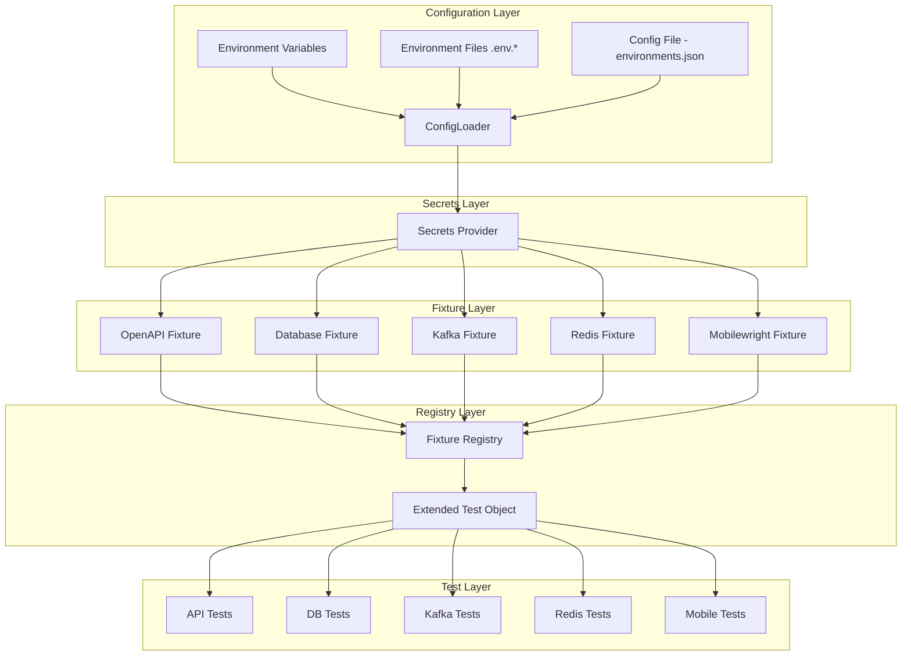

# Design Document: Playwright Framework Template

## Overview

This design describes a reusable Playwright test framework template that provides an extensible fixture architecture for API and integration testing. The framework leverages Playwright's `test.extend()` mechanism to compose fixtures into a single extended test object, enabling tests to declaratively request connections to OpenAPI services, databases (PostgreSQL/MySQL/SQLite), Kafka brokers, Redis servers, and mobile devices via Mobilewright.

The architecture follows a layered approach:
1. **Configuration Layer** — loads and validates environment-based settings
2. **Fixture Layer** — individual fixture modules with setup/teardown lifecycle
3. **Registry Layer** — composes fixtures into the extended Playwright test object
4. **Test Layer** — user-authored tests that consume fixtures via dependency injection

Key design decisions:
- **Playwright's native `test.extend()`** is used for fixture composition rather than a custom DI container, keeping the framework aligned with Playwright idioms
- **Each fixture is a self-contained module** with its own configuration schema, setup, and teardown logic
- **Configuration uses a three-tier layered approach** (env vars > .env file > config file) with validation at startup
- **Secrets are fetched and cached** via a pluggable provider library before fixture initialization
- **TypeScript strict mode** throughout for type safety

## Architecture



### Project Directory Structure

```
playwright-framework/
├── package.json
├── tsconfig.json
├── playwright.config.ts
├── environments.json
├── .env.example
├── .env.local.example
├── .env.dev.example
├── README.md
├── src/
│   ├── config/
│   │   ├── loader.ts              # ConfigLoader - loads and validates config
│   │   ├── env-loader.ts          # EnvLoader - dotenv file parser and loader
│   │   ├── schema.ts              # Configuration type definitions & validation
│   │   └── index.ts               # Re-exports
│   ├── secrets/
│   │   ├── provider.interface.ts  # Extensible SecretsProvider interface
│   │   ├── secrets-manager.ts     # Main SecretsManager (caching, resolution)
│   │   ├── providers/
│   │   │   ├── aws.provider.ts    # AWS Secrets Manager provider
│   │   │   ├── gitlab.provider.ts # GitLab CI/CD Variables provider
│   │   │   ├── vault.provider.ts  # HashiCorp Vault provider
│   │   │   ├── azure.provider.ts  # Azure Key Vault provider
│   │   │   ├── env-file.provider.ts # Local .env fallback provider
│   │   │   └── index.ts           # Provider registry
│   │   └── index.ts               # Re-exports
│   ├── fixtures/
│   │   ├── openapi.fixture.ts     # OpenAPI client fixture
│   │   ├── database.fixture.ts    # Database connection fixture
│   │   ├── kafka.fixture.ts       # Kafka producer/consumer fixture
│   │   ├── redis.fixture.ts       # Redis client fixture
│   │   ├── mobilewright.fixture.ts # Mobilewright mobile testing fixture
│   │   └── index.ts               # Fixture Registry - composes all fixtures
│   └── index.ts                   # Main entry - exports extended test object
├── tests/
│   ├── examples/
│   │   ├── openapi.spec.ts        # OpenAPI fixture example test
│   │   ├── database.spec.ts       # Database fixture example test
│   │   ├── kafka.spec.ts          # Kafka fixture example test
│   │   ├── redis.spec.ts          # Redis fixture example test
│   │   └── mobilewright.spec.ts   # Mobilewright fixture example test
│   └── custom-fixture.example.ts  # Example of creating a custom fixture
└── docs/
    └── custom-fixtures.md         # Guide for creating custom fixtures
```

## Components and Interfaces

### 1. EnvLoader (`src/config/env-loader.ts`)

Responsible for loading and parsing per-environment dotenv files.

```typescript
interface EnvLoader {
  load(environment: string): Record<string, string>;
}
```

**Behavior:**
- Looks for `.env.{environment}` file in the project root (e.g., `.env.local`, `.env.dev`, `.env.test`, `.env.stg`, `.env.prod`)
- Parses dotenv format: key-value pairs (`KEY=value`), comments (lines starting with `#`), empty lines, and quoted values (single or double quotes)
- Returns a `Record<string, string>` map of parsed key-value pairs
- If the file does not exist, returns an empty map without throwing an error (graceful fallback)
- Does not set values into `process.env` — returns the parsed map for the ConfigLoader to merge

### 2. ConfigLoader (`src/config/loader.ts`)

Responsible for loading, merging, and validating configuration from three tiers: environment variables, environment files, and the configuration file.

```typescript
interface ConfigLoader {
  load(environmentName?: string): FrameworkConfig;
}
```

**Behavior:**
- Reads `environments.json` from the project root (tier 3 — lowest precedence)
- Calls `EnvLoader.load(environment)` to load the `.env.{environment}` file (tier 2 — medium precedence)
- Reads environment variables with prefix `PW_` (tier 1 — highest precedence)
- Applies three-tier precedence: env vars > .env file values > environments.json values
- Environment is selected via `PW_ENVIRONMENT` env var or `--environment` CLI param
- Supports 5 named environments: `local`, `dev`, `test`, `stg`, `prod`
- Throws `ConfigurationError` with missing keys listed if validation fails

### 3. Fixture Registry (`src/fixtures/index.ts`)

Composes all fixture definitions into a single extended Playwright test object using chained `test.extend()` calls.

```typescript
import { test as base } from '@playwright/test';
import { openApiFixture } from './openapi.fixture';
import { databaseFixture } from './database.fixture';
import { kafkaFixture } from './kafka.fixture';
import { redisFixture } from './redis.fixture';
import { mobilewrightFixture } from './mobilewright.fixture';

export const test = base.extend<FixtureTypes>({
  ...openApiFixture,
  ...databaseFixture,
  ...kafkaFixture,
  ...redisFixture,
  ...mobilewrightFixture,
});

export { expect } from '@playwright/test';
```

**Dependency Resolution:**
- Playwright's built-in fixture system handles dependency resolution natively
- Fixtures declare dependencies by listing other fixture names as parameters
- Circular dependencies are detected by Playwright at test startup and reported as errors
- Missing dependencies result in TypeScript compilation errors (type-level enforcement) and runtime errors from Playwright

### 4. OpenAPI Client Fixture (`src/fixtures/openapi.fixture.ts`)

```typescript
interface OpenApiClient {
  client: AxiosInstance & OperationMethods;
  api: OpenAPIClientAxios;
}

interface OpenApiFixtureConfig {
  specPath: string;          // Local path or remote URL
  baseUrl?: string;          // Override base URL
  specTimeout?: number;      // Remote fetch timeout (default: 10000ms)
  initTimeout?: number;      // Client init timeout (default: 30000ms)
}
```

**Lifecycle:**
1. **Setup**: Load OpenAPI spec (file or URL with 10s timeout) → Initialize `OpenAPIClientAxios` → Call `api.init()` → Return client with operation methods
2. **Teardown**: No persistent connections to release (axios is stateless), but clears internal references

### 5. Database Fixture (`src/fixtures/database.fixture.ts`)

```typescript
interface DatabaseClient {
  query<T = Record<string, unknown>>(sql: string, params?: unknown[]): Promise<T[]>;
  execute(sql: string, params?: unknown[]): Promise<{ affectedRows: number }>;
  close(): Promise<void>;
}

interface DatabaseFixtureConfig {
  type: 'postgresql' | 'mysql' | 'sqlite';
  host?: string;
  port?: number;
  database: string;
  username?: string;
  password?: string;
  connectionTimeout?: number;  // Default: 10000ms
  queryTimeout?: number;       // Default: 30000ms
}
```

**Lifecycle:**
1. **Setup**: Read config → Create connection pool (pg/mysql2/better-sqlite3) → Verify connectivity with a ping query
2. **Teardown**: Drain connection pool → Close all connections

**Driver mapping:**
- PostgreSQL → `pg` library
- MySQL → `mysql2` library
- SQLite → `better-sqlite3` library

### 6. Kafka Fixture (`src/fixtures/kafka.fixture.ts`)

```typescript
interface KafkaClient {
  produce(topic: string, messages: KafkaMessage[]): Promise<void>;
  consume(topic: string, options?: ConsumeOptions): Promise<KafkaMessage[]>;
  disconnect(): Promise<void>;
}

interface KafkaMessage {
  key: string | null;
  value: string | Buffer;
  topic: string;
  partition: number;
  offset: string;
}

interface ConsumeOptions {
  timeout?: number;       // Default: 30000ms
  count?: number;         // Max messages to consume
  fromBeginning?: boolean;
}

interface KafkaFixtureConfig {
  brokers: string[];
  clientId?: string;
  ssl?: boolean;
  sasl?: SASLOptions;
  disconnectTimeout?: number;  // Default: 5000ms
}
```

**Lifecycle:**
1. **Setup**: Create `Kafka` instance → Create producer (connect) → Create consumer with unique group ID (`test-{testId}-{timestamp}`) → Connect consumer
2. **Teardown**: Disconnect producer → Disconnect consumer (within 5s timeout)

### 7. Redis Fixture (`src/fixtures/redis.fixture.ts`)

```typescript
interface RedisClient {
  get(key: string): Promise<string | null>;
  set(key: string, value: string, ttl?: number): Promise<void>;
  del(key: string): Promise<number>;
  publish(channel: string, message: string): Promise<number>;
  subscribe(channel: string, options?: SubscribeOptions): Promise<string | null>;
  quit(): Promise<void>;
}

interface SubscribeOptions {
  timeout?: number;  // Default: 5000ms
}

interface RedisFixtureConfig {
  host: string;
  port: number;
  password?: string;
  db?: number;
  keyPrefix?: string;          // Test-scoped key prefix for isolation
  connectionTimeout?: number;  // Default: 5000ms
}
```

**Lifecycle:**
1. **Setup**: Create `ioredis` client with config → Verify connection with PING → If `keyPrefix` is set, create a separate subscriber client for pub/sub
2. **Teardown**: If `keyPrefix` is set, flush keys matching `{keyPrefix}*` → Disconnect subscriber client → Quit main client

### 8. Custom Fixture Pattern

The documented pattern for creating custom fixtures:

```typescript
// src/fixtures/my-custom.fixture.ts
import { FrameworkConfig } from '../config';

export interface MyCustomClient {
  // Define your client interface
  doSomething(): Promise<void>;
}

export const myCustomFixture = {
  myCustom: async ({ /* dependencies */ }, use: (client: MyCustomClient) => Promise<void>) => {
    // Setup
    const client = await createClient();
    
    // Provide to test
    await use(client);
    
    // Teardown
    await client.close();
  },
};
```

### 9. Mobilewright Fixture (`src/fixtures/mobilewright.fixture.ts`)

Integrates the Mobilewright mobile testing framework, providing screen and device objects for end-to-end testing of iOS and Android applications.

```typescript
import { MobilewrightClient } from 'mobilewright';
import { screen as mwScreen, device as mwDevice } from '@mobilewright/test';

interface MobilewrightScreen {
  // Locator methods
  getByText(text: string): MobilewrightLocator;
  getByLabel(label: string): MobilewrightLocator;
  getByTestId(testId: string): MobilewrightLocator;
  getByRole(role: string): MobilewrightLocator;
  getByType(type: string): MobilewrightLocator;
  // Action methods
  tap(locator: MobilewrightLocator): Promise<void>;
  doubleTap(locator: MobilewrightLocator): Promise<void>;
  longPress(locator: MobilewrightLocator): Promise<void>;
  fill(locator: MobilewrightLocator, value: string): Promise<void>;
  swipe(direction: 'up' | 'down' | 'left' | 'right'): Promise<void>;
  pressButton(button: string): Promise<void>;
}

interface MobilewrightDevice {
  openUrl(url: string): Promise<void>;
}

interface MobilewrightFixtureConfig {
  platform: 'ios' | 'android';
  bundleId: string;
  deviceName: string;
  appPath: string;
  timeout?: number;  // Default: 60000ms
}
```

**Lifecycle:**
1. **Setup**: Read config → Boot device if not already running → Install application on target device → Create Mobilewright session → Provide `screen` and `device` objects to test
2. **Teardown**: Uninstall test application from device → Release device session

**Packages:**
- `mobilewright` — Core client for device session management
- `@mobilewright/test` — Test utilities providing screen and device abstractions

### 10. SecretsManager (`src/secrets/secrets-manager.ts`)

A pluggable secrets provider library that retrieves sensitive configuration values from external secrets management services and injects them into Connection_Config before fixture initialization.

```typescript
// src/secrets/provider.interface.ts
interface SecretsProvider {
  readonly name: string;
  getSecret(key: string): Promise<string>;
  getSecrets(keys: string[]): Promise<Map<string, string>>;
}

// src/secrets/secrets-manager.ts
interface SecretsManager {
  resolve(config: FrameworkConfig): Promise<FrameworkConfig>;
  getSecret(key: string): Promise<string>;
  getSecrets(keys: string[]): Promise<Map<string, string>>;
  registerProvider(provider: SecretsProvider): void;
}

interface SecretsConfig {
  provider: string;                          // Provider backend name (e.g., 'aws', 'vault', 'gitlab', 'azure', 'env-file')
  options?: Record<string, unknown>;         // Provider-specific options (region, vault URL, etc.)
  keyMappings?: Record<string, string>;      // Maps secret key → Connection_Config field path
  timeout?: number;                          // Fetch timeout in ms (default: 10000)
}
```

**Behavior:**
- Resolves which provider to use based on the `secrets.provider` field in the environment config
- Fetches all required secrets (as defined by `keyMappings`) from the configured provider backend
- Applies a configurable timeout (default 10s) to all provider API calls
- Caches all fetched secrets for the entire test runner invocation (global singleton shared across workers)
- Returns cached values on subsequent requests for the same key without additional provider API calls
- Injects resolved secret values into the appropriate Connection_Config fields based on `keyMappings`
- Throws `SecretsError` if the provider is unrecognized, a fetch fails/times out, or a key mapping references an invalid field

**Provider Implementations:**
- `aws.provider.ts` — Retrieves secrets from AWS Secrets Manager using the AWS SDK
- `gitlab.provider.ts` — Retrieves secrets from GitLab CI/CD Variables via the GitLab API
- `vault.provider.ts` — Retrieves secrets from HashiCorp Vault via the HTTP API
- `azure.provider.ts` — Retrieves secrets from Azure Key Vault using the Azure SDK
- `env-file.provider.ts` — Reads secrets from the local `.env.{environment}` file (fallback for local development)

**Provider Registry (`src/secrets/providers/index.ts`):**
- Maintains a map of provider name → provider instance
- Allows registering custom providers at runtime via `registerProvider()`
- Built-in providers are registered by default

## Data Models

### Configuration Schema

```typescript
interface FrameworkConfig {
  environment: string;
  openapi?: OpenApiFixtureConfig;
  database?: DatabaseFixtureConfig;
  kafka?: KafkaFixtureConfig;
  redis?: RedisFixtureConfig;
  mobilewright?: MobilewrightFixtureConfig;
  secrets?: SecretsConfig;
}

interface SecretsConfig {
  provider: string;                          // Provider backend name
  options?: Record<string, unknown>;         // Provider-specific options
  keyMappings?: Record<string, string>;      // Maps secret key → Connection_Config field path
  timeout?: number;                          // Fetch timeout in ms (default: 10000)
}

interface EnvironmentsFile {
  environments: Record<string, Partial<FrameworkConfig>>;
}
```

### Configuration File Format (`environments.json`)

```json
{
  "environments": {
    "local": {
      "openapi": {
        "specPath": "./specs/api.yaml",
        "baseUrl": "http://localhost:3000"
      },
      "database": {
        "type": "postgresql",
        "host": "localhost",
        "port": 5432,
        "database": "testdb",
        "username": "test",
        "password": "test"
      },
      "kafka": {
        "brokers": ["localhost:9092"]
      },
      "redis": {
        "host": "localhost",
        "port": 6379
      },
      "secrets": {
        "provider": "env-file",
        "keyMappings": {
          "db-password": "database.password",
          "redis-password": "redis.password"
        }
      }
    },
    "stg": {
      "openapi": {
        "specPath": "https://api.staging.example.com/openapi.json",
        "baseUrl": "https://api.staging.example.com"
      },
      "database": {
        "type": "postgresql",
        "host": "staging-db.example.com",
        "port": 5432,
        "database": "testdb",
        "username": "test_user"
      },
      "kafka": {
        "brokers": ["kafka.staging.example.com:9092"],
        "ssl": true
      },
      "redis": {
        "host": "redis.staging.example.com",
        "port": 6379
      },
      "secrets": {
        "provider": "aws",
        "options": {
          "region": "us-east-1",
          "secretPrefix": "staging/"
        },
        "keyMappings": {
          "staging/db-password": "database.password",
          "staging/redis-password": "redis.password",
          "staging/kafka-sasl-password": "kafka.sasl.password"
        },
        "timeout": 10000
      }
    },
    "prod": {
      "openapi": {
        "specPath": "https://api.example.com/openapi.json",
        "baseUrl": "https://api.example.com"
      },
      "database": {
        "type": "postgresql",
        "host": "prod-db.example.com",
        "port": 5432,
        "database": "testdb",
        "username": "test_user"
      },
      "kafka": {
        "brokers": ["kafka.example.com:9092"],
        "ssl": true
      },
      "redis": {
        "host": "redis.example.com",
        "port": 6379
      },
      "secrets": {
        "provider": "vault",
        "options": {
          "url": "https://vault.example.com",
          "mountPath": "secret/data/playwright"
        },
        "keyMappings": {
          "db-password": "database.password",
          "redis-password": "redis.password",
          "kafka-sasl-password": "kafka.sasl.password"
        },
        "timeout": 15000
      }
    }
  }
}
```

### Environment Variable Mapping

| Config Path | Environment Variable | Description |
|---|---|---|
| `environment` | `PW_ENVIRONMENT` | Active environment name |
| `openapi.specPath` | `PW_OPENAPI_SPEC_PATH` | OpenAPI spec file or URL |
| `openapi.baseUrl` | `PW_OPENAPI_BASE_URL` | API base URL override |
| `database.type` | `PW_DB_TYPE` | Database type |
| `database.host` | `PW_DB_HOST` | Database host |
| `database.port` | `PW_DB_PORT` | Database port |
| `database.database` | `PW_DB_NAME` | Database name |
| `database.username` | `PW_DB_USERNAME` | Database username |
| `database.password` | `PW_DB_PASSWORD` | Database password |
| `kafka.brokers` | `PW_KAFKA_BROKERS` | Comma-separated broker list |
| `redis.host` | `PW_REDIS_HOST` | Redis host |
| `redis.port` | `PW_REDIS_PORT` | Redis port |
| `redis.password` | `PW_REDIS_PASSWORD` | Redis password |
| `redis.keyPrefix` | `PW_REDIS_KEY_PREFIX` | Test key prefix |
| `mobilewright.platform` | `PW_MOBILE_PLATFORM` | Target platform (ios or android) |
| `mobilewright.bundleId` | `PW_MOBILE_BUNDLE_ID` | Application bundle identifier |
| `mobilewright.deviceName` | `PW_MOBILE_DEVICE_NAME` | Target device or simulator name |
| `mobilewright.appPath` | `PW_MOBILE_APP_PATH` | Path to the application binary |

### Error Types

```typescript
class ConfigurationError extends Error {
  constructor(
    public readonly missingKeys: Array<{ key: string; source: string }>,
    public readonly filePath?: string,
    public readonly parseError?: string
  ) {
    super(formatConfigError(missingKeys, filePath, parseError));
  }
}

class FixtureError extends Error {
  constructor(
    public readonly fixtureName: string,
    public readonly operation: 'connect' | 'query' | 'produce' | 'consume' | 'init' | 'boot' | 'install',
    public readonly details: Record<string, unknown>,
    public readonly cause?: Error
  ) {
    super(formatFixtureError(fixtureName, operation, details));
  }
}

class SecretsError extends Error {
  constructor(
    public readonly providerName: string,
    public readonly operation: 'fetch' | 'timeout' | 'resolve' | 'mapping',
    public readonly secretKey?: string,
    public readonly details?: Record<string, unknown>,
    public readonly cause?: Error
  ) {
    super(formatSecretsError(providerName, operation, secretKey, details));
  }
}
```

## Correctness Properties

*A property is a characteristic or behavior that should hold true across all valid executions of a system — essentially, a formal statement about what the system should do. Properties serve as the bridge between human-readable specifications and machine-verifiable correctness guarantees.*

### Property 1: Fixture dependency resolution

*For any* valid directed acyclic graph of fixture dependencies, when fixtures are registered and a test requests a fixture with dependencies, each fixture SHALL receive fully initialized instances of all its declared dependencies.

**Validates: Requirements 1.2, 1.3**

### Property 2: Circular dependency detection

*For any* set of fixture registrations that form a circular dependency (A→B→...→A), the framework SHALL throw an error whose message contains all fixture names participating in the cycle.

**Validates: Requirements 1.5**

### Property 3: Unresolved dependency detection

*For any* fixture that declares a dependency on a name not present in the registry, the framework SHALL throw an error whose message contains both the declaring fixture's name and the unresolved dependency name.

**Validates: Requirements 1.4**

### Property 4: OperationId method mapping

*For any* valid OpenAPI specification containing operationId values, after initializing the OpenAPI client, the client object SHALL expose a callable method for each operationId defined in the specification.

**Validates: Requirements 2.3**

### Property 5: Base URL override precedence

*For any* OpenAPI specification with server URLs and a Connection_Config with a baseUrl override, all API calls made through the client SHALL use the override URL, ignoring the specification's server URLs.

**Validates: Requirements 2.6**

### Property 6: Unique consumer group ID generation

*For any* set of concurrent or sequential test executions requesting the Kafka fixture, each test SHALL receive a consumer group ID that is unique across all tests in the run.

**Validates: Requirements 4.1**

### Property 7: Redis key prefix isolation on teardown

*For any* set of Redis keys where some match the configured test-scoped prefix and others do not, when the fixture teardown executes with key-prefix isolation enabled, only keys matching the prefix SHALL be deleted and all other keys SHALL remain unchanged.

**Validates: Requirements 5.4**

### Property 8: Environment variable precedence over config file

*For any* configuration key that has a value defined in both an environment variable and the configuration file, the loaded configuration SHALL contain the environment variable's value, not the config file's value.

**Validates: Requirements 6.1, 8.8**

### Property 9: Error descriptiveness

*For any* fixture operation that fails (connection, query, produce, consume, init, boot, install, config load), the thrown error message SHALL contain all contextual fields specified for that error type (e.g., host and port for connection errors, SQL statement for query errors, topic for produce errors, file path for config errors, platform and deviceName for mobile errors).

**Validates: Requirements 2.4, 3.5, 3.6, 4.5, 4.7, 5.5, 6.3, 6.4, 8.7**

### Property 10: Mobilewright session isolation

*For any* test requesting the Mobilewright_Fixture, the fixture SHALL provide an isolated device session, and teardown SHALL uninstall the app regardless of test outcome (pass, fail, or error).

**Validates: Requirements 8.5**

### Property 11: Secrets caching

*For any* secret key fetched during a test run, subsequent requests for the same key SHALL return the cached value without additional provider API calls.

**Validates: Requirements 9.6**

### Property 12: Secrets provider extensibility

*For any* custom provider implementing the SecretsProvider interface and registered with the SecretsManager, the framework SHALL use that provider when configured for an environment.

**Validates: Requirements 9.5**

### Property 13: Three-tier config precedence

*For any* config key with values in all three sources (env var, .env file, environments.json), the loaded value SHALL be the env var value; if absent from env vars, the .env file value; if absent from both, the environments.json value.

**Validates: Requirements 6.1**

## Error Handling

### Error Hierarchy

All framework errors extend a base `FrameworkError` class for consistent handling:

```
FrameworkError
├── ConfigurationError      — config loading/validation failures
├── FixtureInitError        — fixture setup failures (connection, init)
├── FixtureOperationError   — fixture runtime failures (query, produce, consume)
├── SecretsError            — secrets fetching/resolution failures
└── DependencyError         — fixture dependency resolution failures
```

### Error Handling Strategy

| Scenario | Behavior |
|---|---|
| Config file missing | Throw `ConfigurationError` with file path |
| Config file invalid JSON | Throw `ConfigurationError` with file path + parse error |
| Required config key missing | Throw `ConfigurationError` listing all missing keys and their expected sources |
| .env file missing | Fall back to environments.json without error |
| Fixture dependency unresolved | Throw `DependencyError` with fixture name + missing dep name |
| Circular fixture dependency | Throw `DependencyError` with list of cycle participants |
| OpenAPI spec load failure | Throw `FixtureInitError` with spec path/URL + failure reason |
| Database connection timeout | Throw `FixtureInitError` with host, port, timeout value |
| Database query failure | Throw `FixtureOperationError` with SQL statement + failure reason |
| Kafka broker unreachable | Throw `FixtureInitError` with broker address + failure reason |
| Kafka produce failure | Throw `FixtureOperationError` with topic + failure reason |
| Kafka consume timeout | Return empty array (not an error) |
| Redis connection timeout | Throw `FixtureInitError` with host, port, timeout value |
| Mobilewright device boot failure | Throw `FixtureInitError` with platform, deviceName, failure reason |
| Mobilewright app install failure | Throw `FixtureInitError` with platform, deviceName, appPath, failure reason |
| Secret fetch failure | Throw `SecretsError` with provider name, secret key, failure reason |
| Secret fetch timeout | Throw `SecretsError` with provider name, secret key, timeout value |
| Unrecognized provider | Throw `SecretsError` with unrecognized provider name + list of available providers |
| Invalid key mapping | Throw `SecretsError` with secret key name + unrecognized Connection_Config field |

### Teardown Error Handling

- Teardown errors are logged but do not fail the test (test result is preserved)
- If Kafka disconnect exceeds 5s timeout, force-close connections and log a warning
- If Redis key flush fails, log a warning (keys may leak but test is not affected)
- If Mobilewright app uninstall fails, log a warning (app may remain installed but session is released)
- Mobilewright session release is always attempted even if uninstall fails

## Testing Strategy

### Dual Testing Approach

This framework uses both unit tests and property-based tests for comprehensive coverage:

- **Property-based tests** (using [fast-check](https://github.com/dubzzz/fast-check)): Verify universal properties across generated inputs — configuration merging, error formatting, dependency resolution, key isolation, session isolation
- **Unit tests** (using Playwright's built-in test runner): Verify specific examples, edge cases, and integration points
- **Integration tests**: Verify actual connectivity with external services (run separately, require infrastructure)

### Property-Based Testing Configuration

- Library: `fast-check` (TypeScript-native, works with any test runner)
- Minimum iterations: 100 per property test
- Each property test references its design document property
- Tag format: **Feature: playwright-framework, Property {number}: {property_text}**

### Test Organization

```
tests/
├── unit/
│   ├── config-loader.spec.ts       # Config loading, merging, validation
│   ├── env-loader.spec.ts          # Dotenv file parsing, fallback behavior
│   ├── secrets-manager.spec.ts     # Secrets resolution, caching, provider selection
│   ├── fixture-registry.spec.ts    # Dependency resolution, cycle detection
│   ├── openapi-fixture.spec.ts     # Spec loading, method mapping
│   ├── database-fixture.spec.ts    # Driver selection, error formatting
│   ├── kafka-fixture.spec.ts       # Group ID generation, error formatting
│   ├── redis-fixture.spec.ts       # Key prefix logic, error formatting
│   └── mobilewright-fixture.spec.ts # Session lifecycle, error formatting
├── properties/
│   ├── config-precedence.prop.ts   # Property 8: env var precedence
│   ├── config-three-tier.prop.ts   # Property 13: three-tier config precedence
│   ├── dependency-resolution.prop.ts # Properties 1, 2, 3
│   ├── operationid-mapping.prop.ts # Property 4
│   ├── base-url-override.prop.ts   # Property 5
│   ├── group-id-uniqueness.prop.ts # Property 6
│   ├── key-prefix-isolation.prop.ts # Property 7
│   ├── error-descriptiveness.prop.ts # Property 9
│   ├── mobilewright-session.prop.ts # Property 10
│   ├── secrets-caching.prop.ts     # Property 11: secrets caching
│   └── secrets-extensibility.prop.ts # Property 12: provider extensibility
├── integration/
│   ├── openapi.integration.ts      # Real API spec loading
│   ├── database.integration.ts     # Real DB connections
│   ├── kafka.integration.ts        # Real Kafka broker
│   ├── redis.integration.ts        # Real Redis server
│   └── mobilewright.integration.ts # Real device/simulator session
└── examples/
    ├── openapi.spec.ts             # Example usage tests
    ├── database.spec.ts
    ├── kafka.spec.ts
    ├── redis.spec.ts
    └── mobilewright.spec.ts        # Mobilewright fixture example test
```

### Unit Test Coverage

| Component | Key Scenarios |
|---|---|
| ConfigLoader | Load from file, three-tier precedence (env var > .env file > config file), missing keys, invalid JSON, environment selection |
| EnvLoader | Parse key-value pairs, handle comments, handle empty lines, handle quoted values, graceful fallback for missing file |
| SecretsManager | Provider selection per environment, secret caching across requests, timeout handling, key mapping resolution, unrecognized provider error, invalid mapping error |
| Fixture Registry | Single fixture, multiple fixtures, dependencies, missing deps, cycles |
| OpenAPI Fixture | Local file load, URL load, timeout, invalid spec, base URL override |
| Database Fixture | Driver selection (pg/mysql/sqlite), connection error formatting, query error formatting |
| Kafka Fixture | Group ID format, produce error formatting, consume timeout returns empty array |
| Redis Fixture | Key prefix matching, connection error formatting, subscribe timeout |
| Mobilewright Fixture | Session creation, device boot sequence, app install/uninstall, teardown on failure, error formatting |

### Integration Test Requirements

Integration tests require running infrastructure (Docker Compose recommended):
- PostgreSQL 15+
- MySQL 8+
- Apache Kafka 3.x
- Redis 7+
- iOS Simulator (Xcode) or Android Emulator (Android SDK) for Mobilewright tests

These tests are tagged with `@integration` and excluded from the default test run.

